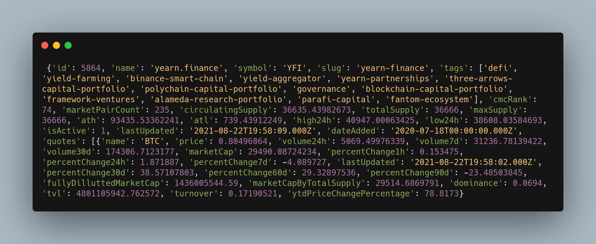

# Cryptocurrency-Price-Web-App
 Cryptocurrency web app with Streamlit

 Project from: https://youtu.be/OYsz4Ww0h3o?list=PLtqF5YXg7GLmCvTswG32NqQypOuYkPRUE

## 1. Create "requirements.txt" file and install libraries

Libraries:

- Pillow: The Python Imaging Library adds image processing capabilities to your Python interpreter. (https://pillow.readthedocs.io/en/latest/index.html)

- base64: In Python the base64 module is used to encode and decode data. First, the strings are converted into byte-like objects and then encoded using the base64 module. The below example shows the implementation of encoding strings isn't base64 characters. (https://docs.python.org/3/library/base64.html)

 ```bash
 pip install -r requirements.txt
 ```



## 2. Create "main.py" file

I had to change the

## 2. Run "streamlit run main.py"
